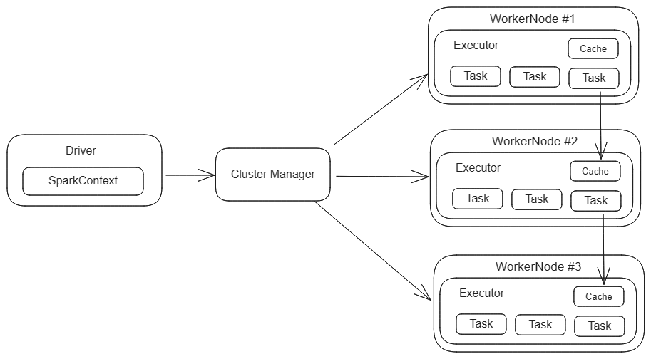

# (Not So) DeepDive - Pyspark

  ## Overview

 - Understanding the Basics
 - Spark Architeture
 - Managing Data: Ingestion and Transformation
 - SparkSQL
 - Streaming data
 - GraphFrames
 - SparkTuning: Caching and Partitioning

## Understanding the Basics
### RDD
RDD or Resilient Distributed Dataset is the primary data abstraction in Spark. RDD enables the parallel processing of datasets by dividing them into manageable chunks.
RDD is the most optimal solution to process large datasets or being the foundation for building and training machine learning models.
### Transformations and Actions

***Transformation*** refers to create a new logical design from an existing one. They don't trigger any type of computation of the underlying data and simply defines a series of steps to be performed. Transformations are often defined by **lazy evaluation** (e.g they are not executed immediately but are added to a lineage that tracks the opperations applied to the data) and **immutability** (e.g. existing RDD will remain unchanged; each transformation creates a new RDD representing the transformed data).

***Actions*** refers to operations that force the computation to be perfomed on the dataset. They trigger the execution of all the preceding transformations in the lineage. Actions are often defined by **materialization** (e.g. actual processing and materialization of the data) and **single result** (e.g. those actions tipically return a single value, such as a count, list or data written to a single file).

## Spark Architeture

### Overview
Spark leverages a master-nodes architecture to create a powerful distributed computing framework. At its foundation, a Spark application involves a central coordinating process (the driver) managing the execution of tasks across multiple machines (worker nodes) within a cluster.
Spark Architeture has the following core components:

 - **Driver Program**
	 -  Houses the  `SparkContext`, which serves as the entry point for interacting with the cluster.
	 - Defines the logical structure (transformations, actions) of the distributed computation.
	 - Coordinates with the Cluster Manager to schedule and manage work on the cluster.
 - **Cluster Manager**
	 - A process responsible for allocating resources to Spark applications and acquiring executors.
	-  Can be standalone (Spark's built-in manager), or external like YARN, Kubernetes, or Mesos.
-  **Worker Nodes**
    -   Machines that provide processing power and storage within the cluster.
    -   Host  *executors*, the processes that perform the actual tasks.

## Data Management
Spark is able to receive a large type of data sources as input, such as, JSON Files, CSV, Kafka Streaming, Database Connection, PARQUET files. And transforms the received data using different functions, such as: filter, map, concat.
## SparkSQL

Spark SQL is a powerful component within the Apache Spark ecosystem that bridges the gap between traditional SQL queries and Spark's distributed processing capabilities. It allows you to query and manipulate data within Spark DataFrames and DataSets using familiar SQL syntax. Underneath the SQL abstraction, Spark SQL employs a powerful query optimizer (Catalyst) that intelligently translates your queries into efficient Spark code for distributed execution.

## Streaming Data
Powerful approach to handling real-time data streams, enabling you to process and analyze data as it arrives continuously. Streaming integrates with various data sources like Kafka, Flume, and Kinesis to ingest real-time data streams. 
## GraphFrames
GraphFrames are an abstraction for Spark. They provide a DataFrame-based representation of graphs, enabling you to leverage familiar DF APIs for graph operations. They use Spark's distributed processing capabilities to handle massive graphs in a efficient way.

## SparkTuning
Tuning refers to the process of optimizing the performance of Spark by adjusting various settings or using different approachs. The main goal is to ensure efficient way of utilizing the avaliable resources. You can tune your application using a memory tuning, parallelism or serialization approach.
### Memory Tuning
- Identify deadlocks by observing how Spark uses storage and execution memory. With these informations, you can adjust memory fractions using spark.memory.fraction or spark.storage.fraction.
### Parallelism Tuning
- Distribute tasks across multiple cores and nodes;
- Configure spark.executor.cores and spark.executor.instances to control the number of cores and executors used;
- Use functions like repartition() and coalesce() to control the number of partitions for your DataFrames or RDDs, influencing the degree of parallelism.
### Serialization
- Utilize serializers like Kryo or KryoSerializer that offer better performance than the default Java serializer.
- Depending of your project, using more efficient data structures like Kryo objects or Avro schemas can improve serialization efficiency.